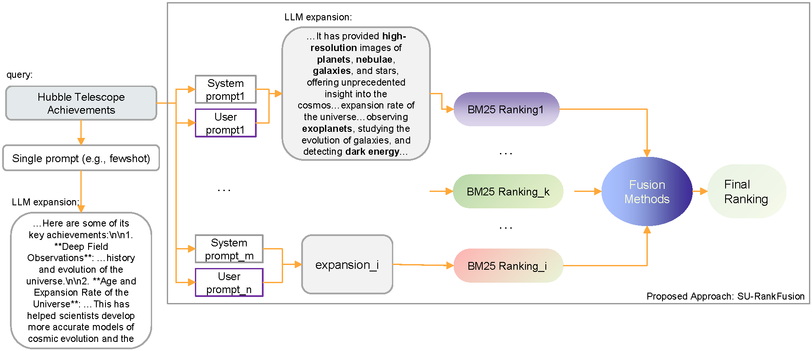
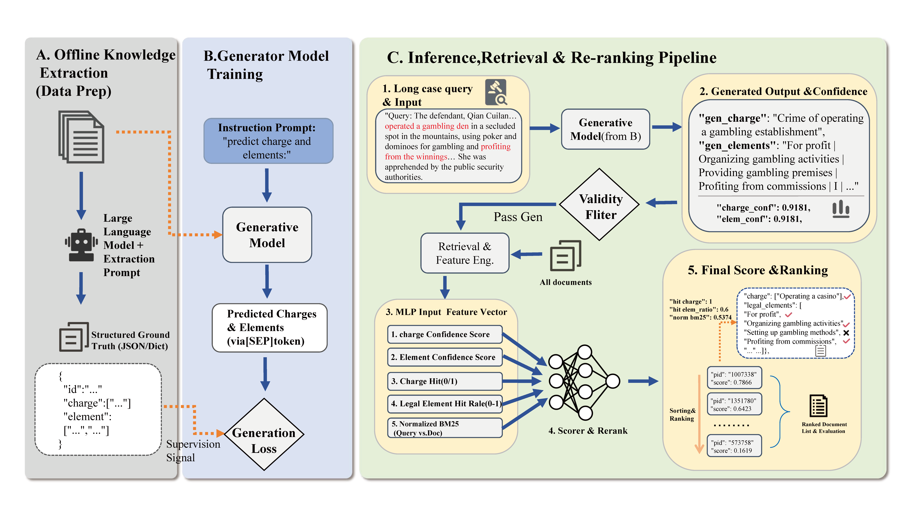
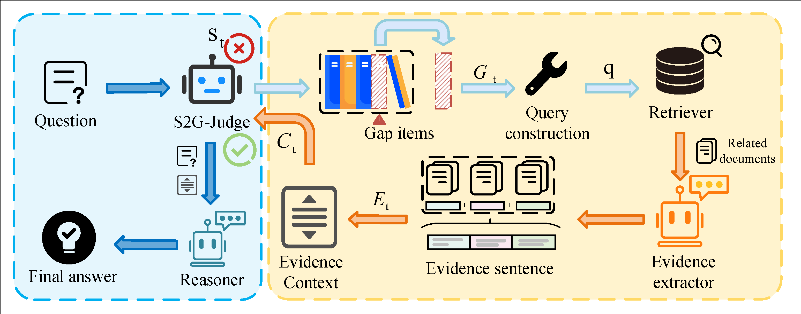
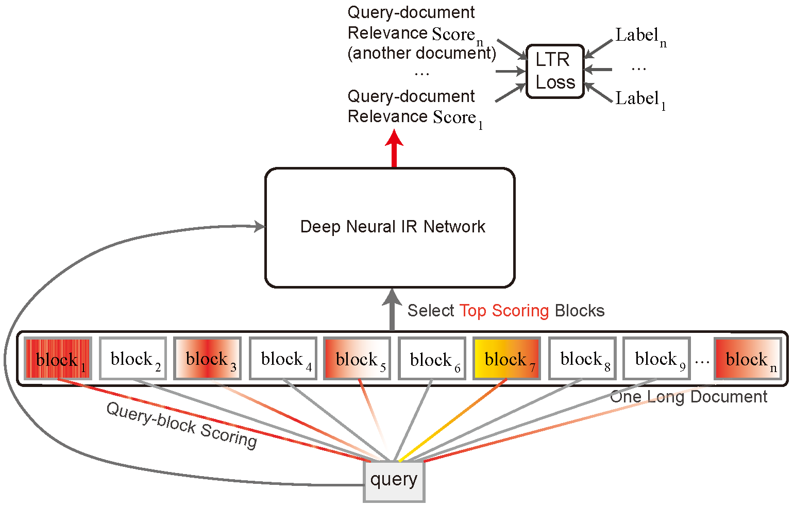








I am currently a faculty member at the School of Computer Science and Technology, Soochow University. My research lies at the intersection of information retrieval, natural language processing, and large language models. I am particularly interested in conversational search, retrieval-augmented generation, long-document retrieval and reranking, legal information retrieval, and efficient and trustworthy LLM-based systems.

I received my B.S. degree from Xi’an Jiaotong University, my M.S. degree from Xidian University, and my Ph.D. degree from Université Grenoble Alpes, where I was advised by Prof. Eric Gaussier. If you are interested in academic collaboration, student supervision, or research discussions, please feel free to contact me at [email].

# 🔥 News
- *2022.02*: &nbsp;🎉🎉 Lorem ipsum dolor sit amet, consectetur adipiscing elit. Vivamus ornare aliquet ipsum, ac tempus justo dapibus sit amet. 
- *2022.02*: &nbsp;🎉🎉 Lorem ipsum dolor sit amet, consectetur adipiscing elit. Vivamus ornare aliquet ipsum, ac tempus justo dapibus sit amet. 

# 📝 Publications 

  

    

      
Information Fusion 2026

      
    

  

  

[Dual-Layer Prompt Ensembles: Leveraging System-and User-Level Instructions for Robust LLM-Based Query Expansion and Rank Fusion](#)

**Minghan Li**, Ercong Nie, Huiping Huang, Xinxuan Lv, Guodong Zhou

*Information Fusion*, 2026

- Robust LLM-based query expansion and rank fusion with dual-layer prompt ensembles.
- Corresponding author and first author.

  

    

      
ACL 2026

      
    

  

  

[GLIER: Generative Legal Inference and Evidence Ranking for Legal Case Retrieval](#)

**Minghan Li**, Tianrui Lv, Chao Zhang, Guodong Zhou

*ACL 2026 Main Conference*

- A generative legal inference framework for legal case retrieval.
- Combines latent legal variable inference with multi-view evidence ranking.
- Corresponding author and co-first author.

  

    

      
ACL 2026

      
    

  

  

[S2G-RAG: Structured Sufficiency and Gap Judging for Iterative Retrieval-Augmented QA](#)

**Minghan Li**, Junjie Zou, Xinxuan Lv, Chao Zhang, Guodong Zhou

*ACL 2026 Main Conference*

- An iterative RAG framework with structured sufficiency judgment and gap-guided retrieval.
- Designed for multi-hop QA and evidence-aware iterative retrieval.
- Corresponding author and co-first author.

  

    

      
TOIS 2023

      
    

  

  

[The Power of Selecting Key Blocks with Local Pre-ranking for Long Document Information Retrieval](#)

**Minghan Li**, Diana Nicoleta Popa, Johan Chagnon, Yagmur Gizem Cinar, Eric Gaussier

*ACM Transactions on Information Systems*, 2023

- Studies key-block selection for long document retrieval.
- A representative journal paper on long-document IR.

## 📚 Conference and Journal Papers

- `AAAI 2026` RFKG-CoT: Relation-Driven Adaptive Hop-count Selection and Few-Shot Path Guidance for Knowledge-Aware QA, Chao Zhang, **Minghan Li**, Tianrui Lv, Guodong Zhou
- `COLING 2024` Domain Adaptation for Dense Retrieval and Conversational Dense Retrieval through Self-Supervision by Meticulous Pseudo-Relevance Labeling, **Minghan Li**, Eric Gaussier
- `SIGIR 2022` BERT-based Dense Intra-ranking and Contextualized Late Interaction via Multi-task Learning for Long Document Retrieval, **Minghan Li**, Eric Gaussier
- `AAAI 2022` Listwise Learning to Rank Based on Approximate Rank Indicators, Thibaut Thonet, Yagmur Gizem Cinar, Éric Gaussier, **Minghan Li**, Jean-Michel Renders
- `SIGIR 2021` KeyBLD: Selecting Key Blocks with Local Pre-ranking for Long Document Information Retrieval, **Minghan Li**, Eric Gaussier
- `ICPR 2020` Learning to Rank for Active Learning: A Listwise Approach, **Minghan Li**, Xialei Liu, Joost van de Weijer, Bogdan Raducanu

## 🗂 Preprints and Surveys

- `arXiv 2026` Automatic In-Domain Exemplar Construction and LLM-Based Refinement of Multi-LLM Expansions for Query Expansion, **Minghan Li**, Ercong Nie, Siqi Zhao, Tongna Chen, Huiping Huang, Guodong Zhou
- `arXiv 2026` GenState-AI: State-Aware Dataset for Text-to-Video Retrieval on AI-Generated Videos, **Minghan Li**, Tongna Chen, Tianrui Lv, Yishuai Zhang, Suchao An, Guodong Zhou
- `arXiv 2026` Retrieval-Feedback-Driven Distillation and Preference Alignment for Efficient LLM-based Query Expansion, **Minghan Li**, Guodong Zhou
- `arXiv 2025` Enhanced Retrieval of Long Documents: Leveraging Fine-Grained Block Representations with Large Language Models, **Minghan Li**, Eric Gaussier, Guodong Zhou
- `arXiv 2025` A Survey of Long-Document Retrieval in the PLM and LLM Era, **Minghan Li**, Miyang Luo, Tianrui Lv, Yishuai Zhang, Siqi Zhao, Ercong Nie, Guodong Zhou
- `arXiv 2025` Query Expansion in the Age of Pre-trained and Large Language Models: A Comprehensive Survey, **Minghan Li**, Xinxuan Lv, Junjie Zou, Tongna Chen, Chao Zhang, Suchao An, Ercong Nie, Guodong Zhou
- `arXiv 2024` EviRerank: Adaptive Evidence Construction for Long-Document LLM Reranking, **Minghan Li**, Eric Gaussier, Juntao Li, Guodong Zhou

<!-- [**Project**](https://scholar.google.com/citations?view_op=view_citation&hl=zh-CN&user=DhtAFkwAAAAJ&citation_for_view=DhtAFkwAAAAJ:ALROH1vI_8AC) <strong></strong>
- Lorem ipsum dolor sit amet, consectetur adipiscing elit. Vivamus ornare aliquet ipsum, ac tempus justo dapibus sit amet. 

- [Lorem ipsum dolor sit amet, consectetur adipiscing elit. Vivamus ornare aliquet ipsum, ac tempus justo dapibus sit amet](https://github.com), A, B, C, **CVPR 2020** -->

<!-- # 🎖 Honors and Awards
- *2021.10* Lorem ipsum dolor sit amet, consectetur adipiscing elit. Vivamus ornare aliquet ipsum, ac tempus justo dapibus sit amet. 
- *2021.09* Lorem ipsum dolor sit amet, consectetur adipiscing elit. Vivamus ornare aliquet ipsum, ac tempus justo dapibus sit amet.  -->

# 📖 Educations
- *2020.10 - 2023.12*, Ph.D. in Computer Science, Université Grenoble Alpes.
- M.S. in Computer Technology, Xidian University.
- B.E. in Information Engineering, Xi’an Jiaotong University.

<!-- # 💬 Invited Talks
- *2021.06*, Lorem ipsum dolor sit amet, consectetur adipiscing elit. Vivamus ornare aliquet ipsum, ac tempus justo dapibus sit amet. 
- *2021.03*, Lorem ipsum dolor sit amet, consectetur adipiscing elit. Vivamus ornare aliquet ipsum, ac tempus justo dapibus sit amet.  \| [\[video\]](https://github.com/)

# 💻 Internships
- *2019.05 - 2020.02*, [Lorem](https://github.com/), China. -->
