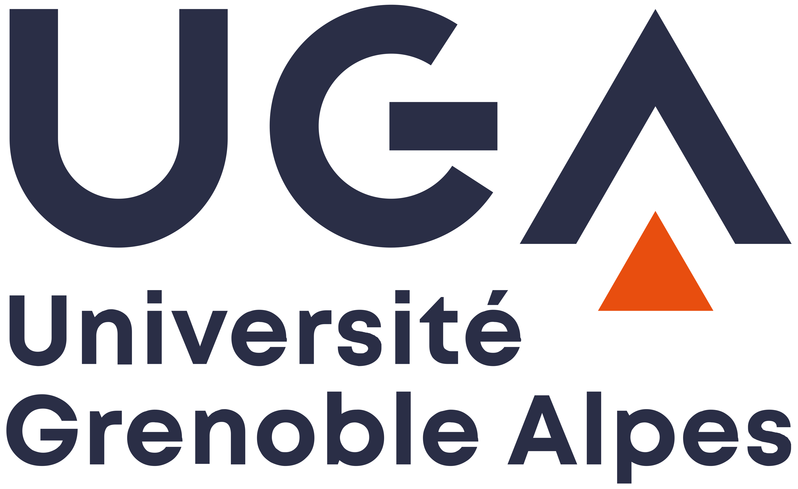








I joined the School of Computer Science and Technology at Soochow University in 2024, where I am currently an Associate Professor. My research lies at the intersection of information retrieval, natural language processing, and large language models. I am particularly interested in conversational search and retrieval-augmented generation, memory and reasoning for LLM-based agents, long-document retrieval and reranking, legal AI, and efficient and trustworthy LLM systems.

I received my B.S. degree from Xi’an Jiaotong University, my M.S. degree from Xidian University, and my Ph.D. degree from [Université Grenoble Alpes](https://www.univ-grenoble-alpes.fr/), France, where I was advised by Prof. [Eric Gaussier](https://scholar.google.com/citations?user=rCpJslsAAAAJ). If you are interested in academic collaboration, student supervision, or research discussions, please feel free to contact me by [email](mailto:{{ site.author.email }}).

<a class="group-invitation" href="{{ '/group/' | relative_url }}"><small>RESEARCH GROUP</small><strong>{{ site.data.group.tagline }}</strong>{{ site.data.group.name }} ({{ site.data.group.short_name }})↗</a>

# 🔥 News



# 📝 Selected Publications

<small>* Corresponding author; † Co-first author.</small>

  

    

      
Information Fusion 2026

      
    

  

  

[Dual-Layer Prompt Ensembles: Leveraging System-and User-Level Instructions for Robust LLM-Based Query Expansion and Rank Fusion](#)

**Minghan Li***, Ercong Nie, Huiping Huang, Xinxuan Lv, Guodong Zhou

*Information Fusion*, 2026 (JCR Q1, CAAI-A journal, IF 17.4)

- Robust query expansion and rank fusion via dual-layer prompt ensembles.

  

    

      
ACL 2026

      
    

  

  

[GLIER: Generative Legal Inference and Evidence Ranking for Legal Case Retrieval](#)

**Minghan Li***†, Tianrui Lv†, Chao Zhang, Guodong Zhou

*ACL 2026 Main Conference*

- Generative legal inference and evidence ranking for legal case retrieval.

  

    

      
ACL 2026

      
    

  

  

[S2G-RAG: Structured Sufficiency and Gap Judging for Iterative Retrieval-Augmented QA](#)

**Minghan Li***†, Junjie Zou†, Xinxuan Lv, Chao Zhang, Guodong Zhou

*ACL 2026 Main Conference*

- Iterative RAG with structured sufficiency judgment and gap-guided retrieval.

  

    

      
TOIS 2023

      
    

  

  

[The Power of Selecting Key Blocks with Local Pre-ranking for Long Document Information Retrieval](#)

**Minghan Li**, Diana Nicoleta Popa, Johan Chagnon, Yagmur Gizem Cinar, Eric Gaussier

*ACM Transactions on Information Systems*, 2023 (JCR Q1, **CCF-A journal**, IF 11.2)

- Key-block selection with local pre-ranking for long-document retrieval.

## 📚 Conference and Journal Papers

<small>* Corresponding author; † Co-first author.</small>

- TOIS 2026 A Survey of Long-Document Retrieval in the PLM and LLM Era 
  **Minghan Li***, Yishuai Zhang, Tianrui Lv, Siqi Zhao, Miyang Luo, Ercong Nie, Guodong Zhou (JCR Q1, **CCF-A journal**, IF 11.2)
- TOIS 2026 Query Expansion in the Age of Pre-trained and Large Language Models: A Comprehensive Survey 
  **Minghan Li***, Xinxuan Lv, Junjie Zou, Tongna Chen, Chao Zhang, Suchao An, Ercong Nie, Guodong Zhou (JCR Q1, **CCF-A journal**, IF 11.2)
- Information Fusion 2026 Dual-Layer Prompt Ensembles: Leveraging System-and User-Level Instructions for Robust LLM-Based Query Expansion and Rank Fusion 
  **Minghan Li***, Ercong Nie, Huiping Huang, Xinxuan Lv, Guodong Zhou (JCR Q1, CAAI-A journal, IF 17.4)
- ACL 2026 Main Conference GLIER: Generative Legal Inference and Evidence Ranking for Legal Case Retrieval 
  **Minghan Li***†, Tianrui Lv†, Chao Zhang, Guodong Zhou
- ACL 2026 Main Conference S2G-RAG: Structured Sufficiency and Gap Judging for Iterative Retrieval-Augmented QA 
  **Minghan Li***†, Junjie Zou†, Xinxuan Lv, Chao Zhang, Guodong Zhou
- EMNLP 2026 Main Conference SAGA: Structured Applicability-Guided Alignment for Conversational Legal Retrieval 
  Xinxuan Lv†, **Minghan Li***†, Guodong Zhou
- EMNLP 2026 Main Conference Cascade-SC: A Pareto-Efficient Cross-Model Cascade for Test-Time Reasoning 
  **Minghan Li***†, Siqi Zhao†, Luoliang Hua, Guodong Zhou
- EMNLP 2026 Findings EviRerank: Adaptive Evidence Construction for Long-Document LLM Reranking 
  **Minghan Li***, Eric Gaussier, Juntao Li, Guodong Zhou
- NLPCC 2026 Conference Oral Retrieval-Feedback Aligned Distillation for Deployable LLM Query Expansion 
  **Minghan Li**, Guodong Zhou
- AAAI 2026 RFKG-CoT: Relation-Driven Adaptive Hop-count Selection and Few-Shot Path Guidance for Knowledge-Aware QA 
  Chao Zhang, **Minghan Li***, Tianrui Lv, Guodong Zhou
- COLING 2024 Domain Adaptation for Dense Retrieval and Conversational Dense Retrieval through Self-Supervision by Meticulous Pseudo-Relevance Labeling 
  **Minghan Li**, Eric Gaussier
- TOIS 2023 The Power of Selecting Key Blocks with Local Pre-ranking for Long Document Information Retrieval 
  **Minghan Li**, Diana Nicoleta Popa, Johan Chagnon, Yagmur Gizem Cinar, Eric Gaussier (JCR Q1, **CCF-A journal**, IF 11.2)
- SIGIR 2022 BERT-based Dense Intra-ranking and Contextualized Late Interaction via Multi-task Learning for Long Document Retrieval 
  **Minghan Li**, Eric Gaussier
- AAAI 2022 Listwise Learning to Rank Based on Approximate Rank Indicators 
  Thibaut Thonet, Yagmur Gizem Cinar, Éric Gaussier, **Minghan Li**, Jean-Michel Renders
- SIGIR 2021 KeyBLD: Selecting Key Blocks with Local Pre-ranking for Long Document Information Retrieval 
  **Minghan Li**, Eric Gaussier
- ICPR 2020 Learning to Rank for Active Learning: A Listwise Approach 
  **Minghan Li**, Xialei Liu, Joost van de Weijer, Bogdan Raducanu

## 🗂 Preprints and Surveys

- `arXiv 2026` Automatic In-Domain Exemplar Construction and LLM-Based Refinement of Multi-LLM Expansions for Query Expansion, **Minghan Li**, Ercong Nie, Siqi Zhao, Tongna Chen, Huiping Huang, Guodong Zhou
- `arXiv 2026` GenState-AI: State-Aware Dataset for Text-to-Video Retrieval on AI-Generated Videos, **Minghan Li**, Tongna Chen, Tianrui Lv, Yishuai Zhang, Suchao An, Guodong Zhou
- `arXiv 2026` Retrieval-Feedback-Driven Distillation and Preference Alignment for Efficient LLM-based Query Expansion, **Minghan Li**, Guodong Zhou
- `arXiv 2025` Enhanced Retrieval of Long Documents: Leveraging Fine-Grained Block Representations with Large Language Models, **Minghan Li**, Eric Gaussier, Guodong Zhou

<!-- [**Project**](https://scholar.google.com/citations?view_op=view_citation&hl=zh-CN&user=DhtAFkwAAAAJ&citation_for_view=DhtAFkwAAAAJ:ALROH1vI_8AC) <strong></strong>
- Lorem ipsum dolor sit amet, consectetur adipiscing elit. Vivamus ornare aliquet ipsum, ac tempus justo dapibus sit amet. 

- [Lorem ipsum dolor sit amet, consectetur adipiscing elit. Vivamus ornare aliquet ipsum, ac tempus justo dapibus sit amet](https://github.com), A, B, C, **CVPR 2020** -->

<!-- # 🎖 Honors and Awards
- *2021.10* Lorem ipsum dolor sit amet, consectetur adipiscing elit. Vivamus ornare aliquet ipsum, ac tempus justo dapibus sit amet. 
- *2021.09* Lorem ipsum dolor sit amet, consectetur adipiscing elit. Vivamus ornare aliquet ipsum, ac tempus justo dapibus sit amet.  -->

<!-- # 📖 Educations
- Ph.D. in Computer Science, Université Grenoble Alpes, France.
- M.S. in Computer Technology, [Xidian University](https://en.xidian.edu.cn/), China.
- B.E. in Information Engineering, [Xi’an Jiaotong University](https://en.xjtu.edu.cn/), China. -->

# 💰 Research Grants

- National Natural Science Foundation of China (NSFC) grant: **Research on Causality-Enhanced Memory Mechanisms for Long-Term Conversational Agents**, **Principal Investigator**.
- Soochow University Academic Start-up Fund, **Principal Investigator**.
- *2023* — **Domain Transfer for Conversational Search**, IDEX Université Grenoble Alpes, for a research visit to the National University of Singapore (NUS), **Principal Investigator**.

# 📖 Educations
- Ph.D. in Computer Science,  [Université Grenoble Alpes](https://www.univ-grenoble-alpes.fr/), France.
- M.S. in Computer Technology,  [Xidian University](https://en.xidian.edu.cn/), China.
- B.S. in Information Engineering,  [Xi’an Jiaotong University](https://en.xjtu.edu.cn/), China.

  

<!-- # 💬 Invited Talks
- *2021.06*, Lorem ipsum dolor sit amet, consectetur adipiscing elit. Vivamus ornare aliquet ipsum, ac tempus justo dapibus sit amet. 
- *2021.03*, Lorem ipsum dolor sit amet, consectetur adipiscing elit. Vivamus ornare aliquet ipsum, ac tempus justo dapibus sit amet.  \| [\[video\]](https://github.com/)

# 💻 Internships
- *2019.05 - 2020.02*, [Lorem](https://github.com/), China. -->
